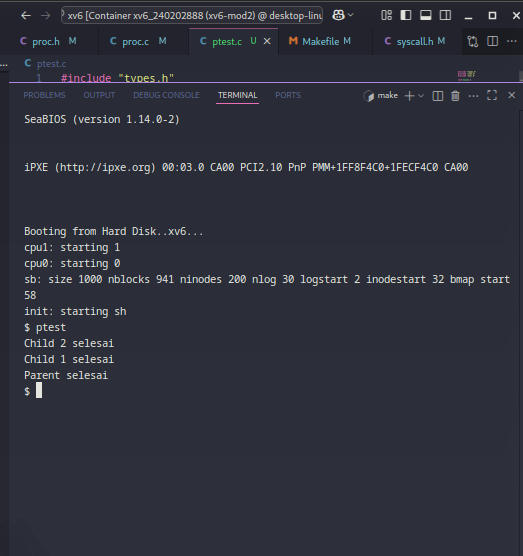

# 📝 Laporan Tugas Akhir

**Mata Kuliah**: Sistem Operasi  
**Semester**: Genap / Tahun Ajaran 2024–2025  
**Nama**: Vigian Agus Isnaeni  
**NIM**: 240202888  

**Modul yang Dikerjakan**:  
Modul 2 – Penjadwalan CPU Lanjutan (Priority Scheduling Non-Preemptive)

---

## 📌 Deskripsi Singkat Tugas

* **Modul 2 – Penjadwalan CPU Lanjutan**  
  Mengubah algoritma penjadwalan proses di `xv6-public` dari **Round Robin** menjadi **Priority Scheduling Non-Preemptive**, dengan menambahkan field `priority` ke setiap proses, membuat syscall `set_priority(int)`, serta memodifikasi scheduler agar menjalankan proses `RUNNABLE` dengan prioritas tertinggi terlebih dahulu (prioritas angka terkecil = paling tinggi).

---

## 🛠️ Rincian Implementasi

* Menambahkan field `int priority` pada `struct proc` di `proc.h`
* Inisialisasi default priority (60) di fungsi `allocproc()` pada `proc.c`
* Menambahkan syscall `set_priority(int)`:
  - Menambah entri `SYS_set_priority` di `syscall.h`
  - Deklarasi syscall di `user.h` dan `usys.S`
  - Registrasi di `syscall.c` (fungsi dan tabel syscall)
  - Implementasi fungsi syscall di `sysproc.c`
* Memodifikasi fungsi `scheduler()` di `proc.c` agar memilih proses `RUNNABLE` dengan `priority` terendah (non-preemptive)
* Membuat program uji `ptest.c` untuk menguji apakah proses dengan prioritas lebih tinggi dijalankan terlebih dahulu
* Menambahkan `_ptest` ke daftar `UPROGS` dalam `Makefile`

---

## ✅ Uji Fungsionalitas

* Program `ptest` membuat dua child process:
  - Child pertama diberi prioritas `90` (lebih rendah)
  - Child kedua diberi prioritas `10` (lebih tinggi)
* Hasil yang diharapkan:
  - Child 2 selesai duluan
  - Child 1 selesai setelahnya
  - Parent selesai terakhir

---

## 📷 Hasil Uji

### 📍 Output `ptest`:

```
Child 2 selesai
Child 1 selesai
Parent selesai
```

### 📸 Screenshot:


---

## ⚠️ Kendala yang Dihadapi
proses terlalu cepat sehingga hasil tidak konsisten 
solusi:parent perlu diberi durasi sleep

---

## 📚 Referensi

* Buku xv6 MIT: [https://pdos.csail.mit.edu/6.828/2018/xv6/book-rev11.pdf](https://pdos.csail.mit.edu/6.828/2018/xv6/book-rev11.pdf)  
* Repositori xv6-public: [https://github.com/mit-pdos/xv6-public](https://github.com/mit-pdos/xv6-public)  
* Diskusi praktikum, GitHub Issues, Stack Overflow
  
---
---