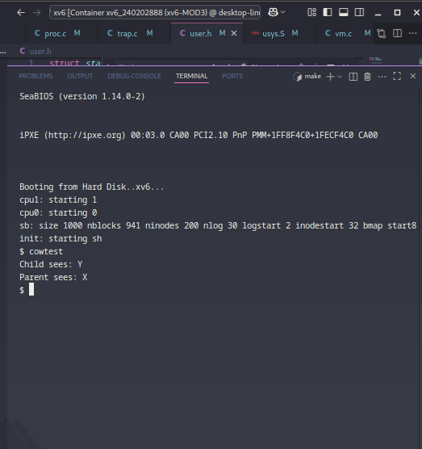
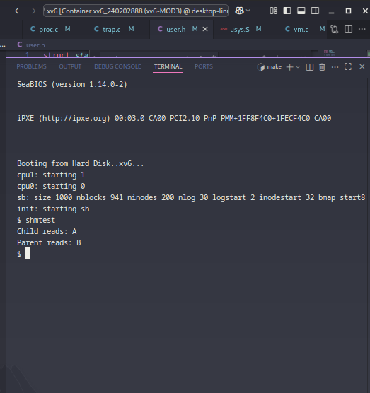

# 📝 Laporan Tugas Akhir

**Mata Kuliah**: Sistem Operasi  
**Semester**: Genap / Tahun Ajaran 2024–2025  
**Nama**: Vigian Agus Isnaeni  
**NIM**: 240202888  
 **Modul yang Dikerjakan**:  
Modul 3 – Manajemen Memori Tingkat Lanjut (Copy-on-Write & Shared Memory)
# 🧪 Modul 3 — Manajemen Memori Tingkat Lanjut (xv6-public x86)
---

## 📌 Deskripsi Singkat Tugas

* **Modul 1 – System Call dan Instrumentasi Kernel**: Menambahkan dua **system call** baru: `getpinfo()` untuk menampilkan informasi proses aktif (PID, ukuran memori, dan nama), dan `getreadcount()` untuk menghitung total pemanggilan `read()` sejak sistem booting.

---

## 🛠️ Rincian Implementasi

* Menambahkan system call `getpinfo()` dan `getreadcount()` di `sysproc.c` dan `syscall.c`.
* Mendaftarkan syscall di `user.h`, `usys.S`, dan `syscall.h`.
* Mendefinisikan struktur `struct pinfo` di `proc.h`.
* Menambahkan dan mengelola counter `readcount` dalam fungsi `sys_read()` di `sysfile.c`.
* Mengimplementasikan mekanisme **sinkronisasi** menggunakan `acquire()` dan `release()` untuk akses `ptable` guna mencegah kondisi `race`.
* Membuat dua program uji: `ptest.c` dan `rtest.c`.
* Menambahkan kedua program uji ke daftar `UPROGS` dalam `Makefile`.

---

## ✅ Uji Fungsionalitas

* `ptest`: Menguji fungsionalitas `getpinfo()`, menampilkan **PID**, **ukuran memori**, dan **nama proses** untuk semua proses yang sedang berjalan.
* `rtest`: Menguji fungsionalitas `getReadCount()`, menampilkan nilai *read count* sebelum dan sesudah operasi pembacaan input.

---

## 📷 Hasil Uji

### 📍 Contoh Output `ptest`:

== Info Proses Aktif ==
PID     MEM     NAME
1       4096    init
2       2048    sh
3       2048    ptest

### 📍 Contoh Output `rtest`:

Read Count Sebelum: 4
hello
Read Count Setelah: 5

### 📸 Screenshot:
**COW**

**shm**

---

## ⚠️ Kendala yang Dihadapi

* **Penanganan pointer dari user space**: Memastikan penanganan yang benar menggunakan `argptr()`.
* **Sinkronisasi akses `ptable`**: Mencegah *race condition* saat mengakses tabel proses.
* **Kesalahan umum**: Seperti salah akses pointer (`.` vs `->`), lupa menyertakan `spinlock.h`, atau kesalahan dalam definisi argumen syscall yang mengakibatkan kegagalan membaca hasil.
* **Penanganan pointer dari user space**: Memastikan penanganan yang benar menggunakan `argptr()`.
* **Sinkronisasi akses `ptable`**: Mencegah *race condition* saat mengakses tabel proses.
* **Kesalahan umum**: Seperti salah akses pointer (`.` vs `->`), lupa menyertakan `spinlock.h`, atau kesalahan dalam definisi argumen syscall yang mengakibatkan kegagalan membaca hasil.
* **Penanganan flag `PTE_COW` dan `PTE_W`**: Harus hati-hati agar tidak menyebabkan *kernel panic*. Pastikan flag ditangani secara tepat saat copy-on-write.
* **Perhitungan `ref_count`**: Salah perhitungan dapat menyebabkan *memory leak* atau *premature free*.
* **Penempatan shared memory di alamat tinggi**: Harus konsisten untuk menghindari bentrok dengan heap atau stack user.
* **Validasi page fault di `trap()`**: Pastikan benar-benar berasal dari akses *write* ke halaman dengan flag `PTE_COW`.

---

## 📚 Referensi

* Buku xv6 MIT: [https://pdos.csail.mit.edu/6.828/2018/xv6/book-rev11.pdf](https://pdos.csail.mit.edu/6.828/2018/xv6/book-rev11.pdf)
* Repositori xv6-public: [https://github.com/mit-pdos/xv6-public](https://github.com/mit-pdos/xv6-public)
* Diskusi praktikum dan dokumentasi di Stack Overflow dan GitHub Issues.

---
