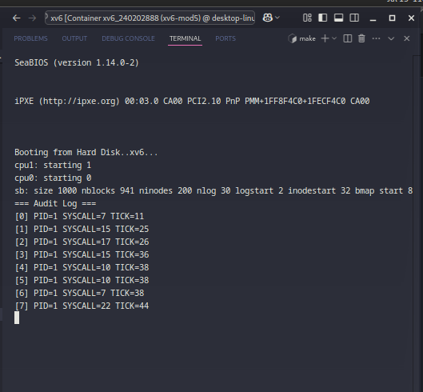

# 📝 Laporan Tugas Akhir

**Mata Kuliah**: Sistem Operasi  
**Semester**: Genap / Tahun Ajaran 2024–2025  
**Nama**: Vigian Agus Isnaeni  
**NIM**: 240202888  
**Modul yang Dikerjakan**:  
Modul 5 – Audit dan Keamanan Sistem (xv6-public)

---

## 📌 Deskripsi Singkat Tugas

- **Modul 5 – Audit dan Keamanan Sistem**:\
  Merekam setiap system call yang dijalankan ke dalam audit log, serta menyediakan syscall `get_audit_log(char *buf, int max)` yang hanya dapat dipanggil oleh proses PID 1 (init) untuk membaca isi log tersebut.

---

## 🛠️ Rincian Implementasi

- Menambahkan struktur `audit_entry` dan array `audit_log[128]` di `syscall.c` untuk menyimpan log
- Mencatat setiap pemanggilan syscall yang valid dalam fungsi `syscall()`
- Membatasi pencatatan hanya sampai 128 entri (log tidak di-overwrite)
- Menambahkan syscall baru `get_audit_log()`:
  - Deklarasi di `user.h`, `syscall.h`, `usys.S`
  - Implementasi di `sysproc.c`
  - Registrasi di `syscall.c`
- Proteksi akses log: hanya proses dengan `PID==1` (init) yang bisa memanggil `get_audit_log()`
- Membuat program uji `audit.c` untuk menampilkan isi audit log
- Menambahkan `_audit` ke dalam daftar UPROGS di `Makefile`

---

## ✅ Uji Fungsionalitas

- `audit`: Menampilkan seluruh audit log jika dijalankan sebagai PID 1 (init)

---

## 📷 Hasil Uji

### 📍 Contoh Output audit:

Jika dijalankan sebagai init:

```
=== Audit Log ===
[0] PID=1 SYSCALL=5 TICK=12
[1] PID=1 SYSCALL=6 TICK=13
[2] PID=1 SYSCALL=11 TICK=15
...
```

Jika dijalankan sebagai proses biasa:

```
Access denied or error.
```

### 📸 Screenshot:



---

## ⚠️ Kendala yang Dihadapi

- Struktur `audit_entry` harus disinkronkan antara `kernel` dan `user` (harus identik di `sysproc.c` dan `audit.c`)
- Kesalahan pointer saat menggunakan `argptr()` dapat menyebabkan sistem crash
- Jika `audit.c` dijalankan bukan oleh PID 1, maka syscall `get_audit_log()` akan gagal dengan return -1
- Log bersifat statis: tidak ada rotasi atau penghapusan entri lama jika penuh (maksimal 128 entri)

---

## 📚 Referensi

- Buku xv6 MIT: [https://pdos.csail.mit.edu/6.828/2018/xv6/book-rev11.pdf](https://pdos.csail.mit.edu/6.828/2018/xv6/book-rev11.pdf)
- Repositori xv6-public: [https://github.com/mit-pdos/xv6-public](https://github.com/mit-pdos/xv6-public)
- Dokumentasi syscall dan praktik kernel pada praktikum Sistem Operasi
